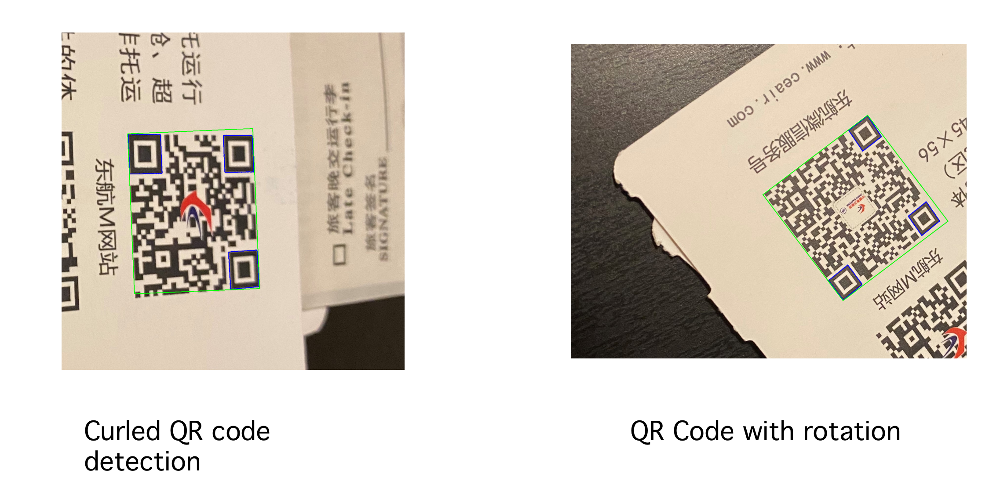
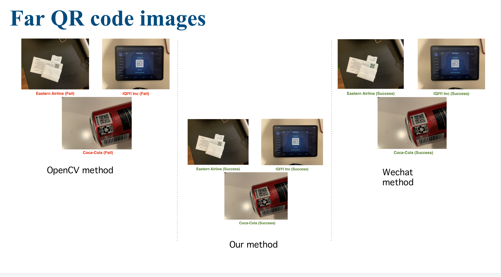
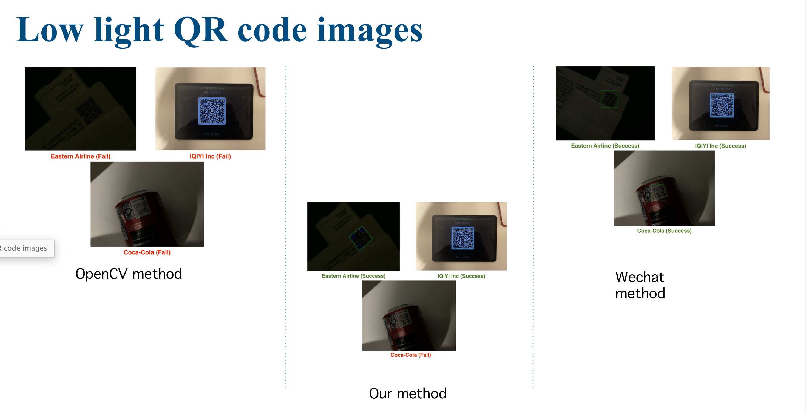
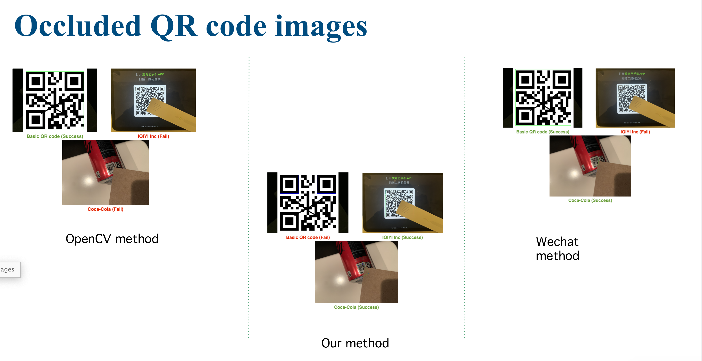
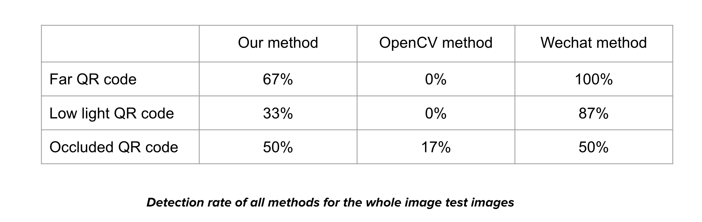

# QR code detection & comparison with OpenCV and WeChat implementation

## Description
Original OpenCV QR Code Scanner is not accurate enough, especially in far or dark environment. So we developed our own detecting method based on QR Code characteristics and C++ knowledge and compared the accuracy between OpenCV, our method and WeChat(the most precise implementation we know).

## Result Walk-through

* Our Method can successfully detect curled and rotated QR Code.

* In far QR Code situation:

* In dark QR Code situation:

* In occluded QR Code situation:

 
* Comparison conclusion between My Method, OpenCV and WeChat:

## Demo Check

https://www.youtube.com/watch?v=dDti9EbQsfI&t=441sv
